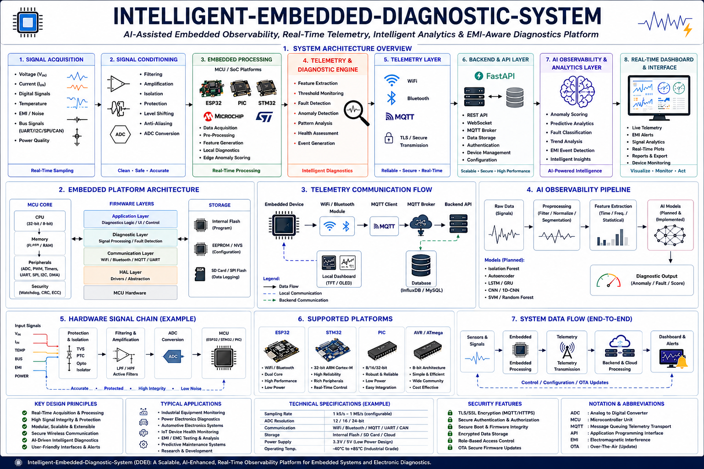

# AI-Embedded-Diagnostic-System

<div align="center">

## DDEI — AI-Assisted Embedded Telemetry & Diagnostic Platform

<p align="center">

</p>

<p align="center">


</p>

</div>

---

<div align="center">

# 🚀 Project Overview

</div>

DDEI (Dispositif de Diagnostic Électronique Intelligent) is a real-time AI-assisted embedded observability and electronic diagnostic platform designed for telemetry acquisition, anomaly detection, EMI-aware monitoring, and intelligent embedded diagnostics.

The system combines embedded acquisition, telemetry infrastructure, AI-assisted interpretation, and real-time visualization to create a scalable diagnostic ecosystem for intelligent electronic analysis.

The platform currently integrates:

- Real-time telemetry acquisition
- EMI anomaly alerting
- AI-assisted anomaly scoring
- Embedded signal monitoring
- FastAPI backend services
- React-based diagnostic dashboard
- Wireless telemetry workflows
- Live engineering visualization

The project focuses on bridging embedded electronics, telemetry infrastructure, and intelligent diagnostic analysis into a unified modern monitoring architecture.

---

<div align="center">

# ⚡ Key Features

</div>

- 🧠 AI-assisted anomaly analysis
- ⚡ EMI anomaly alert system
- 📡 Real-time embedded telemetry
- 📊 Live telemetry visualization dashboard
- 🔌 Embedded signal acquisition
- 📈 Real-time electronic parameter monitoring
- ☁️ FastAPI + React monitoring architecture
- 🧪 Telemetry simulation workflows
- 🔒 Wireless telemetry infrastructure
- 🧠 Intelligent fault interpretation
- ⚠️ Electronic anomaly detection engine
- 📡 Distributed embedded diagnostics

---

<div align="center">

# 🏗️ System Architecture



<br><br>

</div>

---

<div align="center">

# 📊 Real-Time Monitoring Dashboard

</div>

The platform includes a modern React-based diagnostic dashboard capable of visualizing live telemetry streams and embedded diagnostic observables in real time.

Current dashboard capabilities include:

* Live telemetry acquisition
* Real-time signal quality visualization
* AI anomaly scoring
* EMI alert visualization
* Embedded device monitoring
* Telemetry simulation integration
* Dynamic diagnostic charts
* Backend operational monitoring

The dashboard architecture is designed to support future waveform analysis, distributed telemetry supervision, and advanced embedded observability workflows.

---

<div align="center">

# 🔌 Diagnostic Capabilities

</div>

The DDEI architecture is designed to analyze and monitor critical electronic parameters such as:

* Voltage levels
* Current measurements
* Signal integrity
* Communication buses (UART / SPI / I2C)
* Thermal monitoring
* Electronic anomalies
* EMI / Noise observation
* Hardware status diagnostics
* Signal quality analysis
* Embedded telemetry observability

---

<div align="center">

# 🛠️ Technology Stack

</div>

<div align="center">

## 🔌 Embedded Systems


<br><br>


<br><br>


</div>

<br>

<div align="center">

## 💻 Backend & Infrastructure


</div>

<br>

<div align="center">

## 📊 Frontend & Visualization


</div>

<br>

<div align="center">

## ☁️ Telemetry & Communication


</div>

---

<div align="center">

# 🧠 AI & Diagnostic Intelligence

</div>

The AI-assisted diagnostic layer focuses on intelligent interpretation of embedded telemetry and electronic observables.

Current and planned capabilities include:

* AI anomaly scoring
* Embedded fault interpretation
* EMI-related anomaly analysis
* Signal quality evaluation
* Predictive diagnostic workflows
* Telemetry pattern analysis
* Intelligent alert generation
* Embedded observability assistance

The AI engine is designed as a lightweight diagnostic assistance layer supporting scalable embedded analysis architectures.

---

<div align="center">

# 📡 Telemetry Infrastructure

</div>

The telemetry subsystem enables:

* Wireless diagnostic transmission
* Remote monitoring
* Real-time communication
* Distributed diagnostic architectures
* Cloud synchronization
* Embedded data acquisition
* Embedded observability workflows

Supported communication technologies include:

* WiFi
* Bluetooth
* MQTT
* WebSocket
* Serial communication protocols

---

<div align="center">

# 📂 Repository Structure

</div>

```text
docs/
hardware/
firmware/
backend/
frontend/
ai/
simulator/
infrastructure/
````

---

<div align="center">

# 🧪 Simulation & Validation

</div>

The project integrates multiple simulation environments for electronic validation and embedded diagnostic analysis.

Simulation objectives include:

* Signal analysis
* EMI / EMC evaluation
* Embedded telemetry validation
* Communication testing
* Diagnostic verification
* AI anomaly simulation
* Real-time telemetry testing

Supported environments include:

* LTspice
* Proteus
* MATLAB

---

<div align="center">

# 🚧 Development Roadmap

</div>

* [x] FastAPI backend architecture
* [x] React telemetry dashboard
* [x] Live telemetry acquisition
* [x] EMI anomaly alert visualization
* [x] AI anomaly scoring workflows
* [x] Telemetry simulation engine
* [x] Real-time chart visualization
* [ ] Embedded firmware integration
* [ ] MQTT distributed telemetry layer
* [ ] Advanced waveform analysis
* [ ] Persistent telemetry storage
* [ ] TinyML embedded inference
* [ ] Advanced signal diagnostics
* [ ] Hardware synchronization layer
* [ ] Intelligent predictive diagnostics

---

<div align="center">

# 🌍 Future Improvements

</div>

* Edge AI acceleration
* TinyML embedded deployment
* Advanced predictive diagnostics
* Industrial communication protocols
* Advanced waveform analysis
* Intelligent maintenance systems
* Distributed embedded observability
* EMI-aware signal diagnostics
* AI-assisted waveform interpretation
* Cloud-scale telemetry analytics

---

<div align="center">

# 🌐 Engineering Domains

</div>

<div align="center">

| Domain                     | Integration                            |
| -------------------------- | -------------------------------------- |
| ⚡ Electronics Engineering  | Embedded diagnostics & signal analysis |
| 🔌 Embedded Systems        | MCU telemetry & acquisition            |
| 🤖 Artificial Intelligence | AI-assisted anomaly interpretation     |
| 📡 Wireless Communication  | Real-time telemetry infrastructure     |
| ☁️ Cloud Infrastructure    | Distributed monitoring architectures   |
| 📊 Data Visualization      | Real-time embedded dashboards          |
| ⚠️ EMI / EMC Engineering   | Noise-aware embedded diagnostics       |

</div>

---


---

<div align="center">

# 📜 License

This project is licensed under the MIT License.

</div>

---

<div align="center">

# 👨‍💻 Author

### HendyWab / ChendyTronics

Focused on:

Embedded Systems • AI-Assisted Diagnostics • Signal Analysis • Telemetry Infrastructure • Electronic Observability

</div>

---

<div align="center">

## ⚡ Intelligent Embedded Observability for Next-Generation Electronic Systems


</div>
