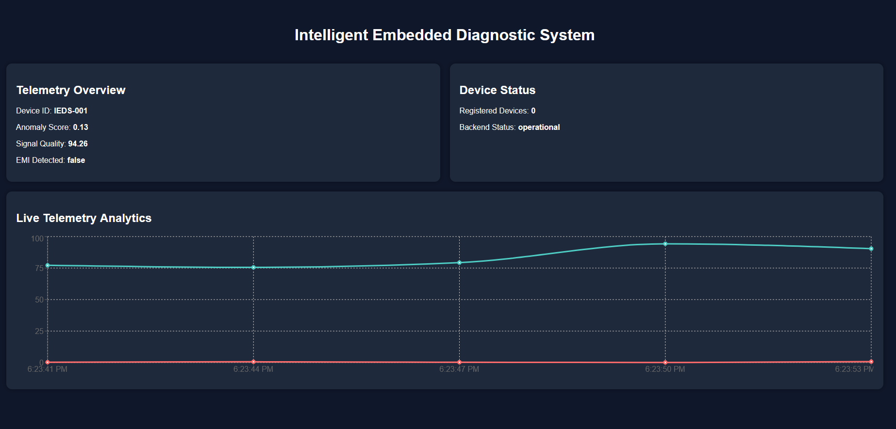

# AI-Embedded-Diagnostic-System

<p align="center">
  
  
  
  
  
</p>

<p align="center">
  
</p>

---

## Real-Time Embedded Observability, Telemetry and AI-Assisted Diagnostic Platform

The **AI-Embedded-Diagnostic-System (IEDS)** is an AI-assisted embedded observability, telemetry, and diagnostic platform designed for real-time electronic diagnostics, anomaly detection, EMI analysis, signal monitoring, and intelligent telemetry visualization.

The platform combines:

- Embedded telemetry acquisition
- Real-time backend processing
- AI-assisted anomaly detection
- Signal observability workflows
- Wireless telemetry infrastructure
- Interactive engineering dashboards
- Embedded diagnostic intelligence

The system is designed as a scalable architecture for:

- Embedded diagnostics
- Intelligent instrumentation
- Electronic fault analysis
- EMI monitoring
- Predictive observability workflows
- Real-time telemetry engineering

---

# System Architecture

<p align="center">
  
</p>

---

# Features

- Real-time telemetry dashboard
- EMI anomaly detection alerts
- AI-assisted anomaly scoring
- Live telemetry visualization
- FastAPI backend architecture
- React frontend interface
- Embedded telemetry simulator
- Dynamic telemetry charts
- Diagnostic observability workflows
- WebSocket-ready telemetry architecture
- Modular embedded diagnostic architecture

---

# Technology Stack

## Backend

- FastAPI
- Python
- Uvicorn
- REST API Architecture

## Frontend

- React
- Vite
- Axios
- Recharts
- Plotly.js (planned)

## Embedded & Telemetry

- ESP32 / STM32 / PIC
- UART / SPI / I2C
- MQTT-ready architecture
- Telemetry simulation engine

## AI & Diagnostics

- Anomaly Scoring
- Signal Analysis
- EMI Detection
- Intelligent Observability

---

# Project Structure

```text
AI-Embedded-Diagnostic-System/
│
├── backend/
│   ├── models/
│   ├── routes/
│   ├── simulator/
│   ├── services/
│   └── main.py
│
├── frontend/
│   ├── src/
│   │   ├── components/
│   │   ├── services/
│   │   └── App.jsx
│   │
│   └── package.json
│
├── assets/
│   ├── architecture/
│   ├── dashboard/
│   └── logos/
│
├── README.md
├── LICENSE
└── requirements.txt
```

---

# Installation

Clone the repository:

```bash
git clone https://github.com/HendyWab/AI-Embedded-Diagnostic-System.git
cd AI-Embedded-Diagnostic-System
```

---

# Backend Setup

Create and activate a virtual environment.

## Windows

```bash
python -m venv venv
venv\Scripts\activate
```

## Linux/macOS

```bash
python3 -m venv venv
source venv/bin/activate
```

Install backend dependencies:

```bash
pip install -r requirements.txt
```

---

# Frontend Setup

Navigate to the frontend directory:

```bash
cd frontend
```

Install frontend dependencies:

```bash
npm install
```

---

# Running the Backend

From the project root:

```bash
uvicorn backend.main:app --reload
```

Backend API:

```text
http://localhost:8000
```

Swagger Documentation:

```text
http://localhost:8000/docs
```

---

# Running the Frontend

From the frontend directory:

```bash
npm run dev
```

Frontend Dashboard:

```text
http://localhost:5173
```

---

# Running the Telemetry Simulator

The telemetry simulator generates synthetic embedded telemetry and diagnostic events in real time.

Run the simulator:

```bash
python backend/simulator/telemetry_simulator.py
```

The simulator continuously generates:

- Anomaly scores
- EMI detection states
- Signal quality metrics
- Telemetry packets
- Diagnostic events

---

# Current Development Status

## Implemented

- FastAPI backend
- React telemetry dashboard
- Real-time telemetry ingestion
- Embedded telemetry simulator
- Live anomaly visualization
- EMI alert system
- Dynamic telemetry charts
- Real-time dashboard updates
- GitHub engineering project management workflow

## In Progress

- WebSocket telemetry streaming
- Persistent telemetry storage
- MQTT integration
- ESP32 hardware integration
- AI anomaly engine improvements
- Multi-device telemetry support

---

# Engineering Objectives

The platform aims to provide:

- Real-time electronic observability
- Intelligent anomaly diagnostics
- Embedded telemetry acquisition
- Wireless diagnostic communication
- Predictive electronic analysis
- Embedded observability infrastructure
- AI-assisted engineering workflows

---

# Future Roadmap

- Real-time WebSocket observability
- Persistent telemetry database
- MQTT broker integration
- ESP32 firmware deployment
- Advanced waveform visualization
- TinyML anomaly inference
- Multi-device observability
- Cloud telemetry synchronization
- Predictive maintenance analytics

---

# Screenshots

## Real-Time Telemetry Dashboard

<p align="center">
  
</p>

---

# GitHub Project Management

This repository uses:

- GitHub Projects
- Engineering milestones
- Issue tracking
- Observability roadmap management

Project workflow includes:

- Telemetry infrastructure
- Embedded integration
- AI diagnostic systems
- Frontend/backend evolution
- Observability engineering

---

# Repository Topics

```text
embedded-systems
telemetry
fastapi
react
ai-diagnostics
observability
iot
electronics
signal-processing
mqtt
esp32
dashboard
anomaly-detection
wireless-telemetry
real-time-systems
```

---


# Author

## NANGNDI Wabede

Embedded Systems • AI-Assisted Diagnostics • Telemetry Engineering • Intelligent Electronic Systems

GitHub:
https://github.com/HendyWab

LinkedIn:
https://www.linkedin.com/in/nangndi-wabede-292318272

---

# License

This project is licensed under the MIT License.

The platform is intended for:

- Research
- Engineering experimentation
- Educational purposes
- Embedded observability development