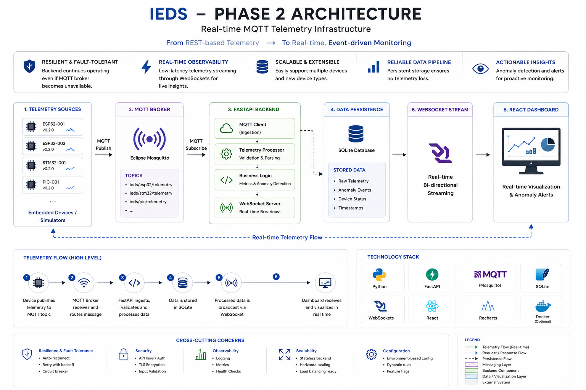
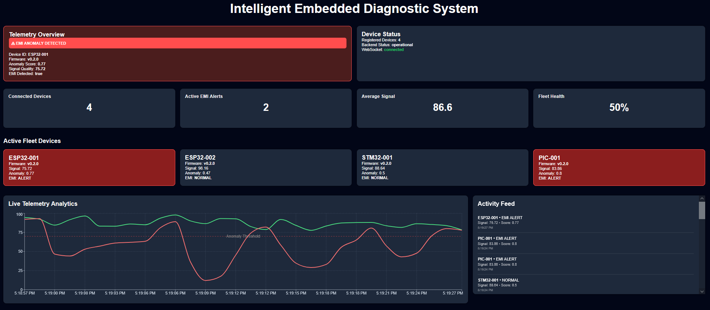
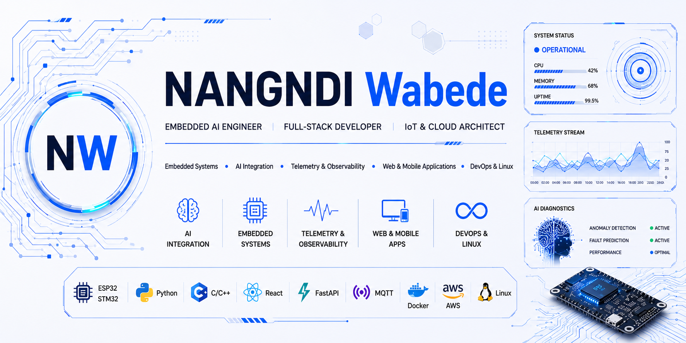

# IEDS — Intelligent Embedded Diagnostic System

<p align="center">
  
  
  
  
  
  
</p>

<p align="center">
  
</p>

---

# Real-Time Embedded Telemetry & Observability Platform

The **Intelligent Embedded Diagnostic System (IEDS)** is a real-time embedded telemetry, observability, and AI-assisted diagnostic platform designed for distributed embedded systems monitoring, EMI anomaly detection, telemetry analytics, and fleet observability engineering.

The platform combines:

* MQTT telemetry infrastructure
* Real-time WebSocket streaming
* Embedded telemetry ingestion
* Fleet observability analytics
* AI-assisted anomaly detection
* EMI monitoring workflows
* Persistent telemetry storage
* Interactive engineering dashboards
* Distributed telemetry supervision

IEDS is designed as a scalable observability architecture for:

* Embedded diagnostics
* Real-time telemetry engineering
* Distributed device monitoring
* Intelligent instrumentation
* Signal quality analysis
* EMI anomaly propagation
* Embedded observability systems

---

# System Architecture

<p align="center">
  
</p>

---

# Telemetry Flow

```text
Embedded Devices / Simulators
        ↓
MQTT Broker (Mosquitto)
        ↓
FastAPI Backend Services
        ↓
Telemetry Processing Engine
        ↓
SQLite Persistence Layer
        ↓
WebSocket Broadcast
        ↓
React Observability Dashboard
```

---

# Features

* Real-time MQTT telemetry ingestion
* Multi-device fleet observability
* WebSocket live telemetry streaming
* EMI anomaly detection & alert propagation
* Real-time telemetry analytics
* Activity/event feed
* Signal quality monitoring
* Persistent telemetry storage
* Fleet health metrics
* Distributed embedded device monitoring
* React observability dashboard
* FastAPI backend infrastructure
* Fault-tolerant telemetry pipeline
* Dynamic telemetry charts
* Real-time anomaly visualization
* Live telemetry broadcasting

---

# Dashboard Preview

<p align="center">
  
</p>

---

# Technology Stack

## Frontend

* React
* Vite
* Axios
* Recharts

## Backend

* FastAPI
* Python
* Uvicorn
* WebSockets
* SQLite

## Telemetry Infrastructure

* MQTT
* Eclipse Mosquitto
* Real-time telemetry streaming
* Distributed telemetry ingestion

## Embedded Systems

* ESP32
* STM32
* PIC MCU
* Embedded telemetry simulators

## AI & Diagnostics

* EMI anomaly detection
* Signal analysis
* Telemetry anomaly scoring
* Observability analytics
* Diagnostic event propagation

---

# Project Structure

```text
AI-Embedded-Diagnostic-System/
│
├── backend/
│   ├── database/
│   ├── mqtt/
│   ├── models/
│   ├── routes/
│   ├── services/
│   ├── simulator/
│   ├── websocket/
│   └── main.py
│
├── frontend/
│   ├── src/
│   │   ├── components/
│   │   ├── services/
│   │   ├── charts/
│   │   └── App.jsx
│   │
│   └── package.json
│
├── assets/
│   ├── architecture/
│   ├── dashboard/
│   └── logos/
│
├── README.md
├── requirements.txt
├── LICENSE
└── .gitignore
```

---

# Installation

Clone the repository:

```bash
git clone https://github.com/HendyWab/AI-Embedded-Diagnostic-System.git
cd AI-Embedded-Diagnostic-System
```

---

# Backend Setup

Create and activate a virtual environment.

## Windows

```bash
python -m venv venv
venv\Scripts\activate
```

## Linux/macOS

```bash
python3 -m venv venv
source venv/bin/activate
```

Install backend dependencies:

```bash
pip install -r requirements.txt
```

---

# Frontend Setup

Navigate to the frontend directory:

```bash
cd frontend
```

Install frontend dependencies:

```bash
npm install
```

---

# Running the Backend

From the project root:

```bash
uvicorn backend.main:app --reload
```

Backend API:

```text
http://localhost:8000
```

Swagger Documentation:

```text
http://localhost:8000/docs
```

---

# Running the Frontend

From the frontend directory:

```bash
npm run dev
```

Frontend Dashboard:

```text
http://localhost:5173
```

---

# Running MQTT Broker

Start Mosquitto MQTT Broker locally.

Default broker:

```text
localhost:1883
```

Example telemetry topics:

```text
ieds/esp32/telemetry
ieds/stm32/telemetry
ieds/pic/telemetry
```

---

# Running the Telemetry Simulator

Run the simulator:

```bash
python backend/simulator/telemetry_simulator.py
```

The simulator generates:

* Real-time telemetry packets
* Signal quality metrics
* EMI anomaly events
* Device activity states
* Telemetry analytics data
* Fleet observability metrics

---

# Current Development Status

## Completed

* MQTT telemetry infrastructure
* Real-time WebSocket streaming
* Multi-device telemetry monitoring
* Persistent telemetry storage
* Fleet observability dashboard
* EMI anomaly propagation
* Activity/event feed
* Dynamic telemetry analytics
* Fault-tolerant backend architecture
* Real-time telemetry visualization

## In Progress

* Historical telemetry analytics
* Authentication system
* ESP32 live hardware integration
* AI anomaly inference engine
* Distributed telemetry scaling
* Advanced observability metrics

---

# Engineering Objectives

IEDS aims to provide:

* Real-time embedded observability
* Intelligent telemetry analytics
* AI-assisted diagnostic workflows
* Distributed embedded supervision
* Scalable telemetry infrastructure
* Real-time fleet monitoring
* Embedded anomaly intelligence
* Modern observability engineering

---

# Roadmap

## Phase 3 — Dashboard Professionalization

* Historical telemetry visualization
* Fleet analytics
* Enhanced observability UX
* Dashboard optimization
* Advanced telemetry filtering

## Phase 4 — Hardware Integration

* ESP32 live telemetry
* Embedded firmware integration
* Wireless telemetry acquisition
* Real sensor integration

## Phase 5 — AI Diagnostics

* Intelligent anomaly classification
* TinyML inference
* Predictive diagnostics
* AI-assisted telemetry analysis

---

# GitHub Engineering Workflow

This repository follows a professional engineering workflow using:

* GitHub Projects
* Feature branch development
* Protected main branch
* Milestone-based releases
* Squash merge strategy
* Semantic version tagging
* Issue-driven development

Current releases:

```text
v0.3-alpha
v0.3.1-ai-stable
v0.4.0
```

---

# Repository Topics

```text
embedded-systems
telemetry
mqtt
fastapi
react
websockets
iot
observability
embedded-observability
electronics
signal-processing
anomaly-detection
real-time-systems
fleet-monitoring
dashboard
python
embedded-diagnostics
```

---

# 👨‍💻 Author

<p align="center">
  
</p>


<div align="center">

### Embedded AI Engineer • Full-Stack Developer • IoT & Cloud Architect

</div>


---

# License

This project is licensed under the MIT License.

The platform is intended for:

- Research
- Engineering experimentation
- Educational purposes
- Embedded observability development
